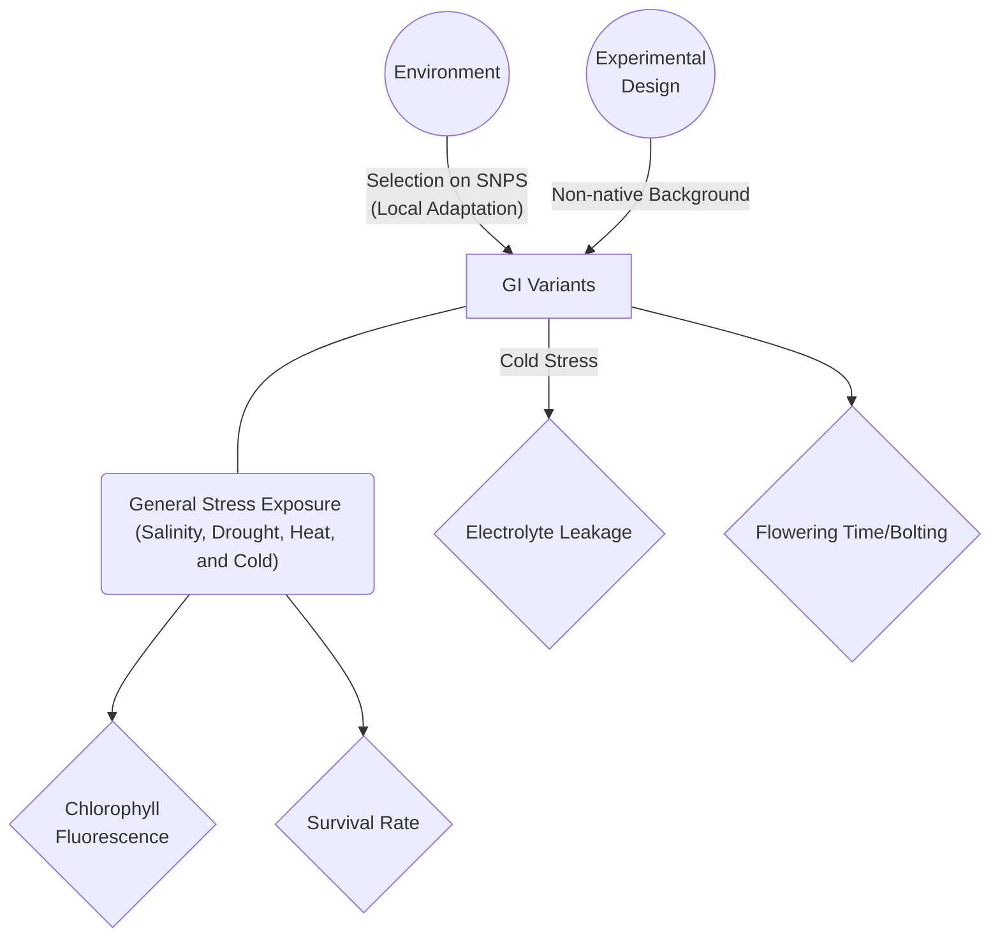
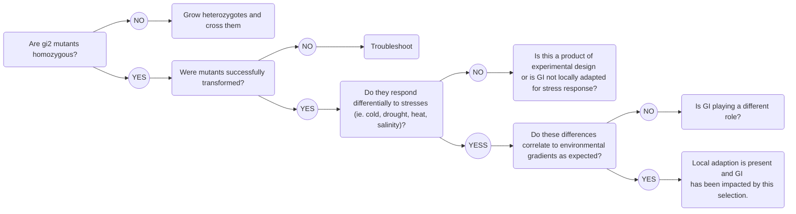

This is a Pathway Analysis/Cause andEffect graphic showing what variables are playing a role in my experiment.

This is a logic tree for the next steps of my experiment. I will be transforming *Arabidopsis thaliana* mutants with gene variants to identify if local adaptation is at play on GI in *P. balsamifera*.

