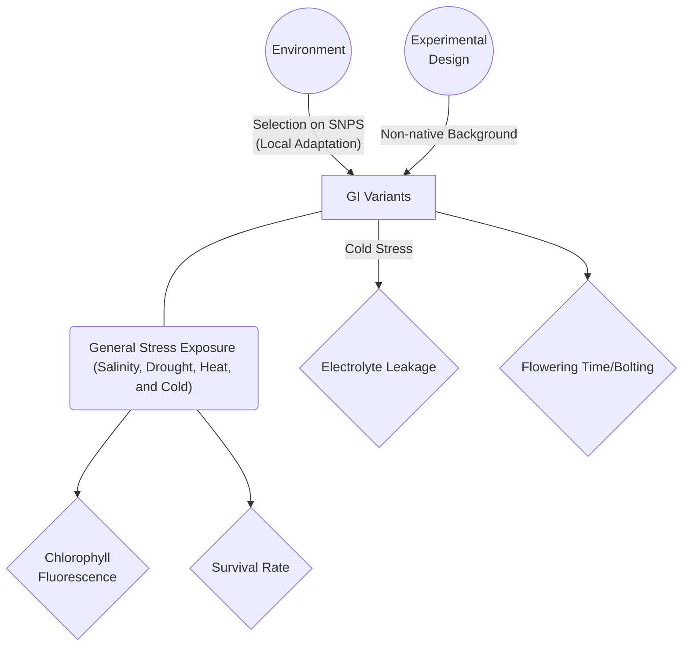
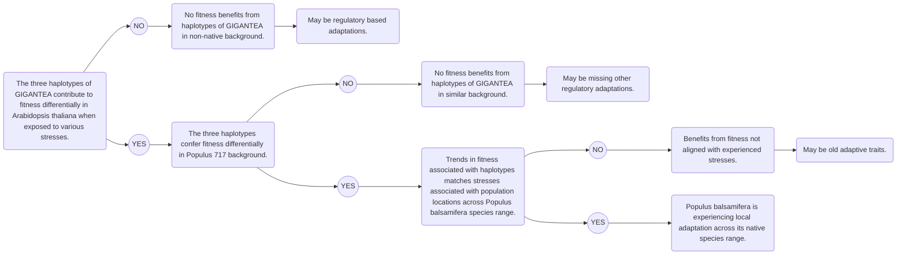

This is a Pathway Analysis/Cause and Effect graphic showing what variables are playing a role in my experiment. Starting on the left, you see the pre-emptive effect of the environment. A population genetics study determined that the gene GIGANTEA (GI) has undergone local adaption in *Populus balsamifera* and created three distinct variants that correlate to mean summer temperature, bud flush and bud set. The literature suggests that GI is involved in various stress responses and plays an important role in the circadian clock and flowering time. I will be taking these GI variants and putting them into a uniform background, the *Arabidopsis thaliana* GI knockout *gi2*. Once successfully transformed, I will expose them to different stresses such as salinity, drought, heat and cold. Upon these manipulations, I will monitor fitness via chlorophyll fluorescence, survival rate, electrolyte leakage, and flowering time/bolting. If our hypothesis is correct, GI should be effecting the way these plants react to the different stresses. The node in the top right entitled experimental design is there because it may effect the GI variants ability to react to the different stresses. The easiest way to put these GI variants into a uniform background, it to put them into the easily transformable and manipulated, model plant *Arabidopsis thaliana*. The issue with this however is that this may interfere with regulatory elements that are the actual cause of local adaption across these variants. In an attempt to account for this, we are attempting to transform a species of poplar that has been shown to be transformable with *Agrobacterium tumefaciens*. 



Below is a flowchart that helped me to visualize the ultimate hypothesis I am trying to prove with the proximate hypothesis I am starting with. Ultimately I am trying to show that local adaptation occurs across a native species range, but to do this, I need to start with the candidate gene loci. After this flow chart is another diagram showing how I can move through these hypotheses.

```flow
hyp1=>start: Ultimate Hypothesis: Local adaptation occurs across native species ranges.
hyp2=>operation: Local adaptation occurs within the Populus balsamifera native species range.
hyp3=>operation: GIGANTEA is a locally adapted loci/gene in Populus balsamifera across it's native species range.
hyp4=>operation: These haplotypes of GIGANTEA contribute to fitness of the trees in relation to their local environments and the associated stresses.
hyp5=>end: Proximate Hypothesis: These haplotypes of GIGANTEA will contribute differently to fitness in Arabidopsis thaliana when exposed to various stresses.
hyp1->hyp2->hyp3->hyp4->hyp5
```

This is a logic tree for my experiments where I will attempt to support the hypothesis that GIGANTIA (GI) is a locally adapted gene in *Populus balsamifera* that contributes to fitness across its native range. I start with the first hypothesis I can answer with my experimental design of whether these haplotypes confer differences in the non-native, but uniform background of *Arabidopsis thaliana*. Even though we have the ability to transform a species of *Populus*, it takes longer and is more difficult so we will do both, but it will come second. This will be finer tuning of the first attempt to move forward. After this we can ask wether those differences make sense in the context of their populations origin and the stresses it would encounter. If all of these line up than we can support our ultimate hypothesis.


